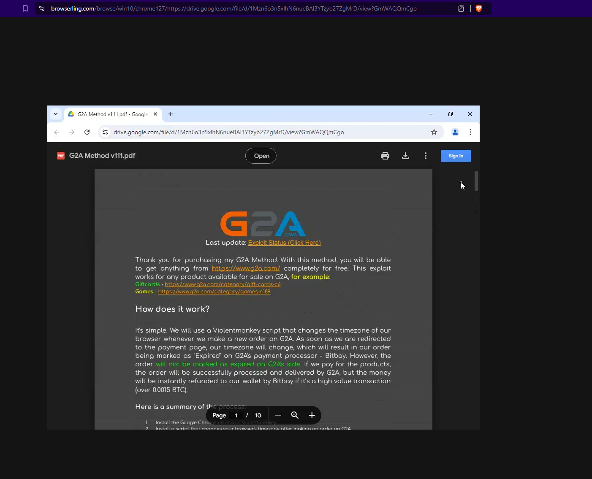
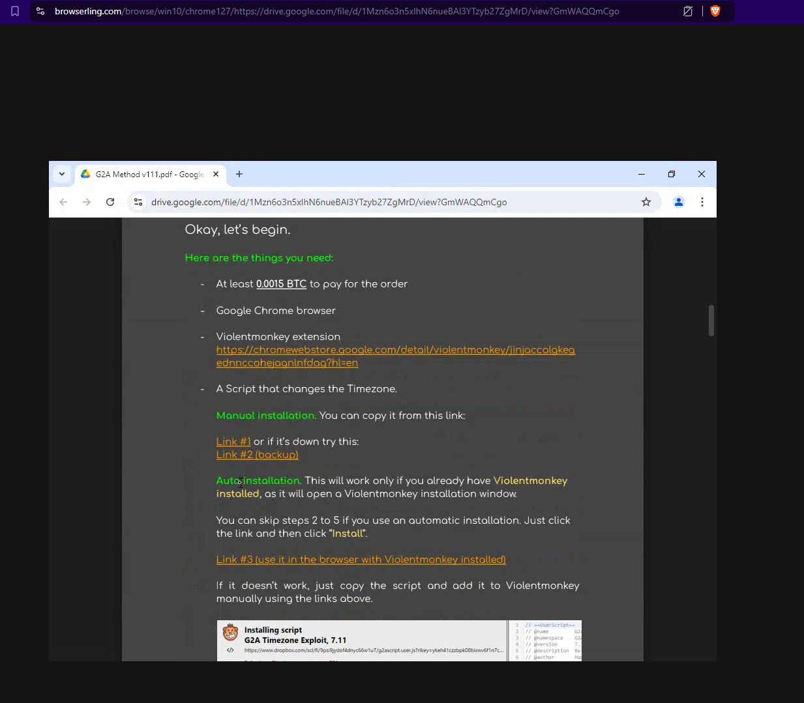
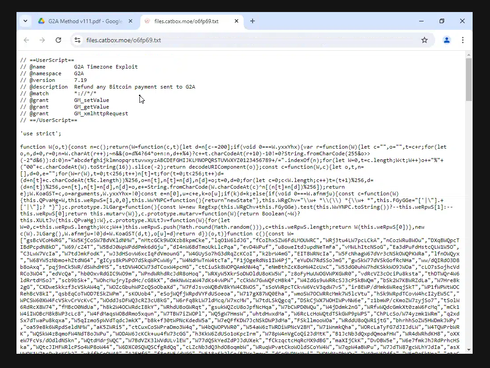

# G2A refund exploit scam

First of all what is G2A?

G2A is a popular online marketplace for digital products such as game keys and software licenses and Bitcoin is one of the payment methods accepted on that platform.

With that being said...

So I found this Google drive document in the wild:
https://drive.google.com/file/d/1Mzn6o3n5xIhN6nueBAl3YTzyb27ZgMrD

Which contains a document about a leaked "exploit" that changes the timezone of the browser so that whenever you make an new order on G2A and as soon as you are redirected
to the payment page the timezone will change which will result in the order
being marked as "Expired" on G2A's payment processor or so they claim...

Now upon reading further it turns out that you need to use their browser extension script in order to achieve what they claim.

They had the script uploaded to various sources such as catbox.moe and PasteBin, when I opened the paste link it turns out that it contained a heavily obfuscated script

The script has several obfuscation methods to conceal its true purpose:

1) Heavily Nested and Self-Invoking Functions: Makes the code execution flow difficult to follow.
2) Dynamic Function Names: Uses non-descriptive, randomly generated names for functions and variables.
3) String Encoding: Contains large arrays of encoded strings that are decoded at runtime.
4) Computed Function Calls: dynamically computes which functions to call and which arguments to pass.

Anti-Debugging methods:
1) Infinite Loops and Stack Overflows: Introduces code that causes infinite recursion when debugging tools are used.
2) Console Method Overrides: Redefines console methods like console.log and console.warn to prevent output and hinder debugging efforts.
3) Developer Tools Detection: Attempts to detect if developer tools are open and alters its behavior accordingly.
4) Self-Defending Code: Executes functions that further obfuscate behavior or cause errors if tampering is detected.
---

After deobfuscating the script, which you can view in here by the way:

https://github.com/StillAching/Malware-Depot/blob/main/G2A-refund-exploit-scam/g2a_payment_exploit_scam_deobfuscated.js

I have also provided a cleaned up version, for much better readability, you can access the full source code in here:

https://github.com/StillAching/Malware-Depot/blob/main/G2A-refund-exploit-scam/g2a_payment_exploit_scam_cleaned.js

I found out that it was indeed a maliciously crafted script and heres what I found out:

The script looks for elements with class names matching specific patterns such as "indexes__BreakableText" and "indexes__QrCodeImage".

It also removes elements and any alerts or warnings that might indicate to the user that something is not right:

Contains a list of the attacker's BitCoin addresses, These addresses will replace the legitimate payment address on the page which is provided by G2A.

It contains a QR Code manipulation function which is responsible for updating the QR code image on the page, it creates a new Image object and once the image loads it replaces the source of the QR code image on the page with the new image URL:

Generates a new QR code URL with the attacker's BitCoin address and the transaction amount in the ``c`` function mentioned earlier above:

It searches for elements displaying the Bitcoin address and replaces the displayed address with one from the attacker's BTC's addresses list (array ``r``)

It extracts the transaction amount from the page content:

The script sends data to an external server a Pipedream endpoint specifically, it sends the transaction amount and this is also used to notify the attacker that a possible victim is about to be frauded

The script contains checks if the transaction amount is above a certain threshold (0.0015 BTC) in this case to encourage tje victim with higher value transactions:

So the long story short is that this is a maliciously crafted script that is designed to replace the legitimate Bitcoin payment details on the payment page (which is provided by G2A) with the attacker's own Bitcoin addresses to trick the victims into sending funds to the wrong address.

# what would be the outcomes if a business were to be targeted by this?

If G2A or any bussniess like it were to be targeted by this malicious activity then the consequences could be severe. 
Here's a breakdown of the potential outcomes & why:

1. Financial Loss:

-This maliciously crafted script successfully replaces the legitimate Bitcoin addresses with the attacker's addresses, customer payments intended for the business would be diverted. This would result in significant financial losses especially if high value transactions are involved.

-If customers realize that they have been defrauded they may demand refunds or compensation from the business even though the business did not receive the funds. This could lead to financial strain and loss of reputation.

2. Reputational Damage:

-Customers who fall victim to the scam may lose trust in the business because they might believe that it is not secure or that it is complicit in the fraud. This could result in damaged brand image.

-News might spread through social media or traditional media and it would damage the business’s reputation and potentially lead to loss of future business opportunities.

3. Legal and Regulatory Consequences:

-The business could face legal action from the affected customers particularly if it is found that the business did not take adequate measures to secure its platform against such attacks.

-Depending on the jurisdiction and the scale of the attack regulatory bodies could investigate the business for failing to protect customer data and funds. This could result in fines or other sanctions.

4. Operational Disruption:

-Significant resources may need to be invested in security audits and system overhauls to prevent similar attacks in the future.

5. Data and Privacy Breaches:

-If the script had capabilities that are beyond just address replacements it could potentially scrape and send sensitive customer's information to the attacker. This could lead to a privacy breach and further legal complications.

6. Customer Support Burden:

-The customer support team would likely be overwhelmed with complaints and inquiries from the affected customers and it would increase the operational strain.

-If the business chooses to compensate affected customers it would lead to additional financial loss and resource allocation.

------
# MITRE ATT&CK TTPs (Indicators)

1)  T1059.007 - Command and Scripting Interpreter: JavaScript
2)  T1546.016 - Event Triggered Execution: User Execution (Malicious Link/UserScript)
3)  T1566.001 - Phishing: Both Phishing & quishing (A.K.A QR code phishing)
4)  T1041 - Exfiltration Over C2 Channel: The script exfiltrates transaction data to an external server via HTTP requests
5)  T1027 - Obfuscated Files or Information: The script uses obfuscated code to hinder detection and analysis efforts.
6)  T1070.004 - Indicator Removal on Host: It removes warning elements from the webpage to avoid detection and notification to the user.
7)  T1485 - Data Destruction or Denial of Service: By removing legitimate payment elements and replacing them with malicious ones, it disrupts the normal business operations and impacts transaction integrity.
8)  T1557.002 - Adversary-in-the-Middle: Man-in-the-Browser The script modifies the webpage content in real-time, replacing Bitcoin addresses and altering QR codes, intercepting the user’s interaction with the legitimate site.
9)  T1071.001 - Application Layer Protocol: Web Protocols The script communicates with an external server using standard HTTP GET requests.

Reference --> https://attack.mitre.org
