# Sodinokibi Ransomware

Hello everybody, today we have something different, I didn't exactly find this one in the wild, I found this sample of the REvil Ransomware (A.K.A Sodinokibi) in the Malware Bazzar, I used this sample specifically: 

https://bazaar.abuse.ch/sample/329983dc2a23bd951b24780947cb9a6ae3fb80d5ef546e8538dfd9459b176483


```
SHA256 hash --> 329983dc2a23bd951b24780947cb9a6ae3fb80d5ef546e8538dfd9459b176483
MD5 hash --> a4331ff805b0a8f2a2892777c224b65e
```

First let's view information about the PE

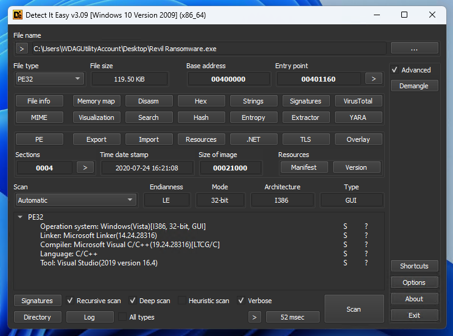

Then I'm going to view the sections of the malware and as we can see according to DIE it is 99% packed, now whats interesting is that there is a section called ``enc`` with 7.99 entropy which is a common indicator for encrypted data.

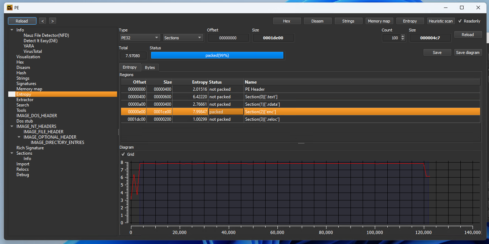

Now its time to view the functions and this is the first function I noticed:

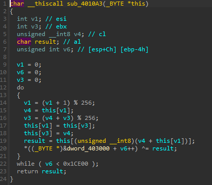

From the looks of it this function performs the RC4 pseudo-random generation algorithm (PRGA) to decrypt data. It modifies the data at dword_403000 using the RC4 state array.

- It performs XOR operations on the data at dword_403000 which is likely the encrypted PE file.

- The loop runs for 0x1CE00 bytes (118272 in decimal) which is the size of the encrypted data.

Then we go ahead and view the second function:

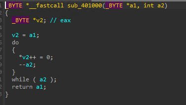

This function initializes a block of memory to zero and It is equivalent to ``memset(a1, 0, a2);``
It zeros out the ``a2`` bytes starting from the pointer ``a1``.

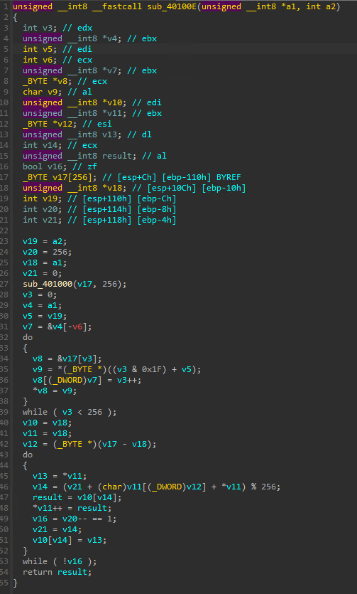

Now the next for function, this function checks if the provided data is a valid PE file.

- It validates whether the provided data represents a valid PE file. 

- It checks the DOS header, PE signature, machine type, and the optional header magic number.

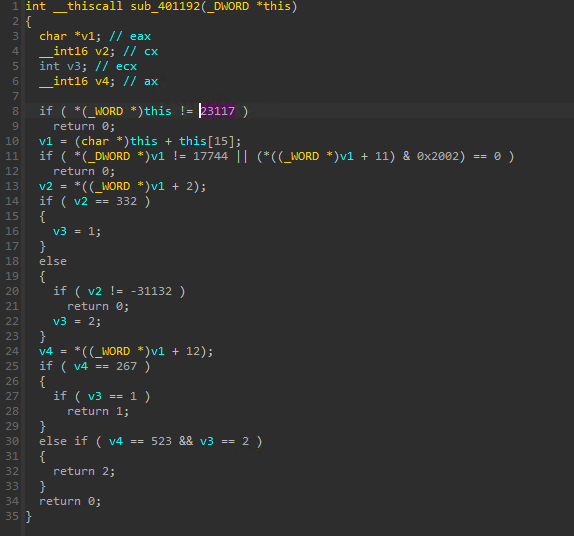

Now this function handles relocation of the loaded PE image.

- It obtains a handle to ntdll.dll and retrieves the address of LdrProcessRelocationBlock.

- It calculates the delta between the preferred base address and the actual base address where the PE image is loaded.

- Iterates through the relocation table of the PE image and applies relocations using LdrProcessRelocationBlock.

And ensures that the PE image is correctly relocated in memory before execution.


The next function resolves the import table for the PE image by loading necessary DLLs and functions. It ensures that all imported functions are correctly linked before execution.


Information so far about the ransomware: 

- The code implements a custom loader for PE files.

- it executes a PE file directly from memory without writing it to the disk, this is most likely a technique used to evade AV detection.

Such techniques are characteristic of a malware especially with droppers or loaders that decrypt and execute payloads.

So far I noticed that the ransomware's loader doesn’t use any Wincrypt API calls to encrypt or decrypt, all encryption algorithms are included in the malware itself and because of that it makes it harder to recognize encryption algorithms included in the ransomware.

below you can see the general structure of the executable

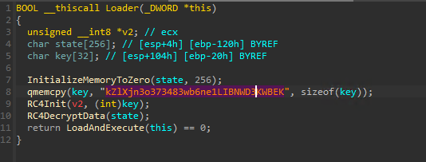

After the Entry function initializes command line arguments it calls the Loader function.
the Loader function first it initializes the key for encrypted section ``enc`` and then decrypts it using RC4 encryption algorithm.

After decrypting the Sodinokibi's core with rc4, The ``LoadAndExecute`` function is called.

And with that being said, we can go ahead and use the rc4 key to obtain Sodinokibi's core, let's go ahead and dump the ``enc`` section

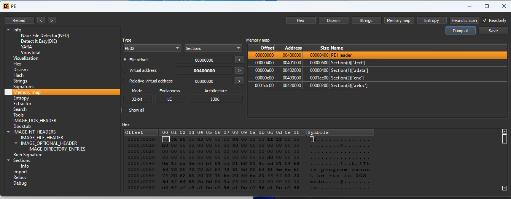

And now let's go ahead and decrypt it with the rc4 key that I've obtained from the Loader function earlier by using a very nice tool called CyberChef


Next up is the main function that handles the loading & execution of the decrypted PE file. It allocates memory by calling , copies the PE image, processes relocations, resolves imports, and executes the PE entry point.

The LoadAndExecute function first calls NtAllocateVirtualMemory & NtWriteVirtualMemory functions to allocate & write the decrypted payload then it verifies if the decrypted block is a valid execute the PE & then finally it rebases the executable and runs it from its
entrypoint.


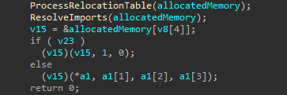

Now that we've dumped & decrypted the Core of the ransomware let's go ahead & use DIE again on the core

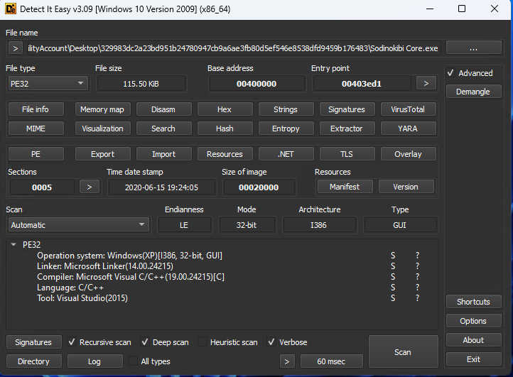

When we look at the ransomware's core we see that the ``.rdata`` & ``.data`` sections have an entropy close to 8 for most of its data, which could indicate that most of its data is encrypted.

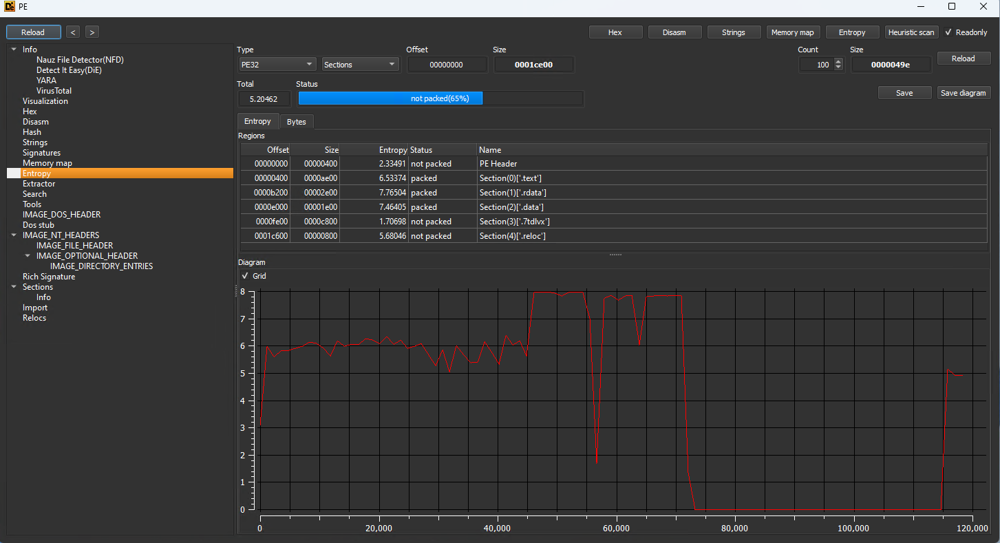

Below we can see the general structure of Sodinokibi's core

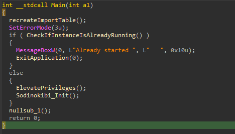

Before the encryption phase starts the ransomware follows a specific execution flow it starts by restoring its export table by using a technique known as API hashing. 

This method is designed to evade static analysis by recreating the import table at runtime & using hashed addresses to locate the required functions.

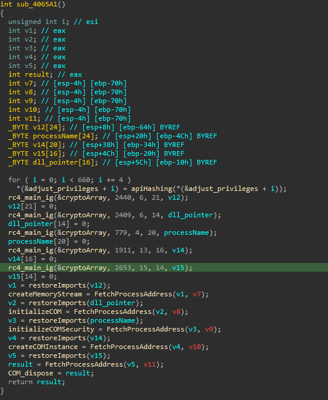

And once the export table is restored then the ransomware has a check that ensures that only one instance is running & its doing that by creating a mutex. 

It then checks if it is being executed with admin privileges. If it lacks the necessary permissions then it will attempt to re-launch itself with elevated previleges. 

This process triggers a standard UAC prompt which indicate that the attacker already has admin access on the target systems when the ransomware was executed.

Now the next thing is that it starts by initializing a configuration file. The configuration data is stored in the malware itself & is encrypted with rc4 (exactly the same case with the loader). 

The configuration file is a JSON object that the ransomware parses the data on this object to initialize its settings & there are also more other settings other than this that is not included in the config file which is also being decrypted and initialized.


So exactly like the case with the loader, we go ahead and fetch the key for the rc4 decryption


And now we go ahead and fetch the encrypted data (the config file)


And now for the decryption process

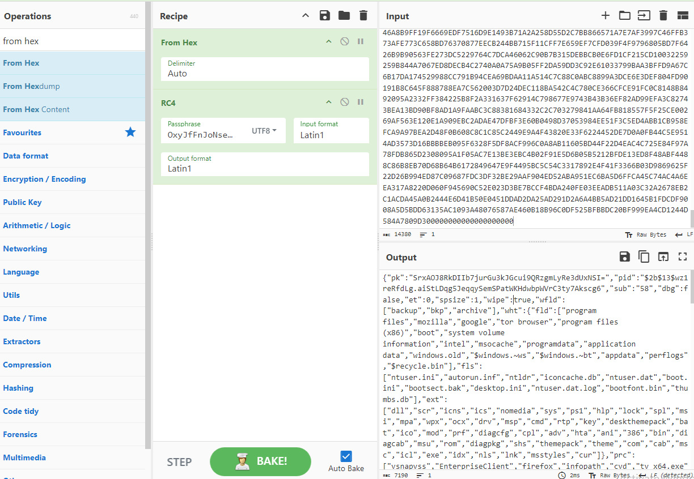

You can access the JSON config file in here:


Now from the looks of it the config files contains a bunch of lists

- Whitelist: Files and folders that are essential to the system's stability that the ransomware avoids encrypting.
- Blacklist: Specific processes and services that are killed/stopped to maximize encryption effectiveness.

It also contains the ransom's note which was encoded with B64:

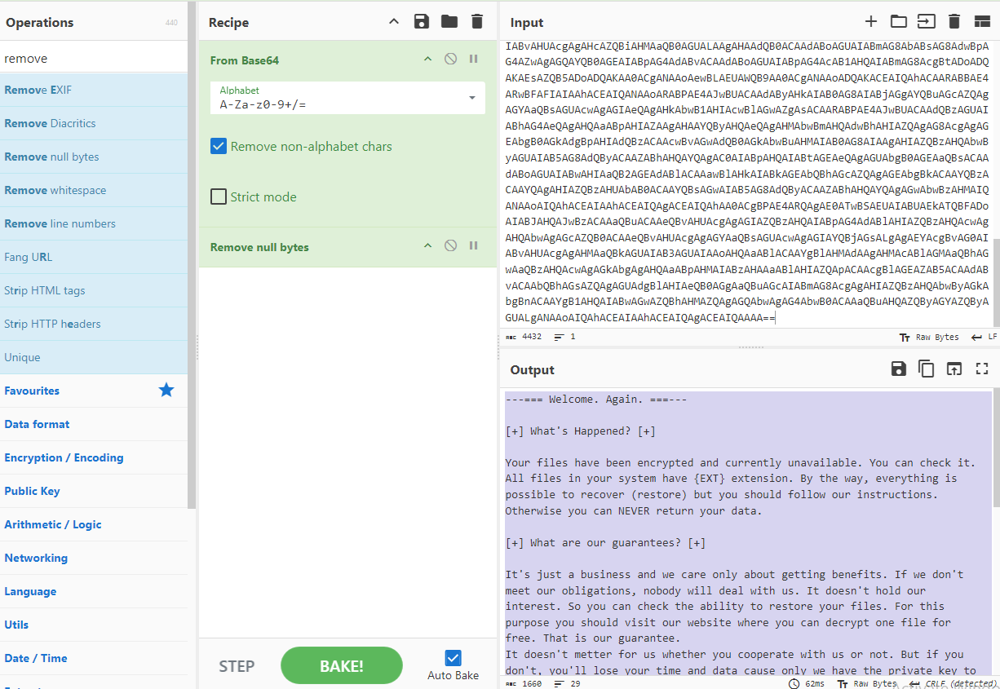

Here's the ransom's note full message:

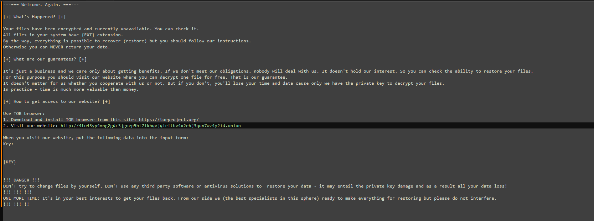

So the ransomware will kill and stop all processes and services that are included in the blacklists on the Config file to make sure that these processes and services are accessible to the ransomware & not interrupted by another process and afterwards it will delete shadow copies that exist on the system to make sure the target can't recover their files

Deletes Windows Volume Shadow Copies with PowerShell code and Get-WMIObject. Executes Get-WMIObject & upon execution there may be no output displayed.

It runs this command (Elevation is required and the ransomware would already have the previleges to do so)

``ps
  Get-WmiObject Win32_Shadowcopy | ForEach-Object {$_.Delete();}
``

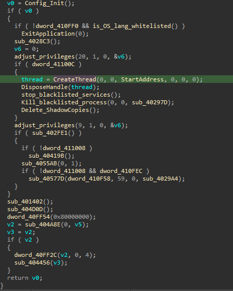

Now the next thing I found out was really interesting because this ransomware has a whitelist of OS languages and has a check if a system is using one of these languages then it will not execute and immediately exit?

Obviously this gives us an idea about the malware's devs origins but in my opinion this is a bad check because most folks have their default Windows language set as English even when English isn't their native language (such as myself)


Here is the list:

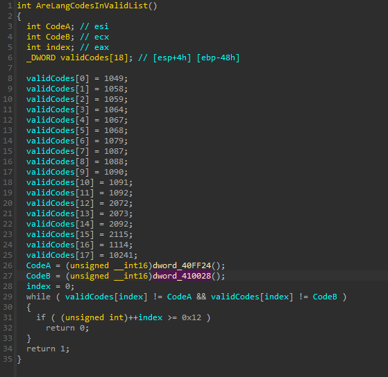

and heres what those Lang IDs are:

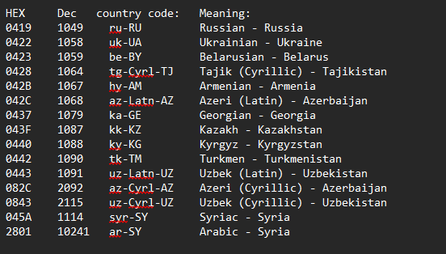

Reference --> https://www.autoitscript.com/autoit3/docs/appendix/OSLangCodes.htm

Now the next thing we will talk about is the encryption process of the malware.
The ransomware starts the encryption by creating a thread for encrypting the files & then calls a function that creates the keys for each file to be encrypted & also writes ransom notes to all folders

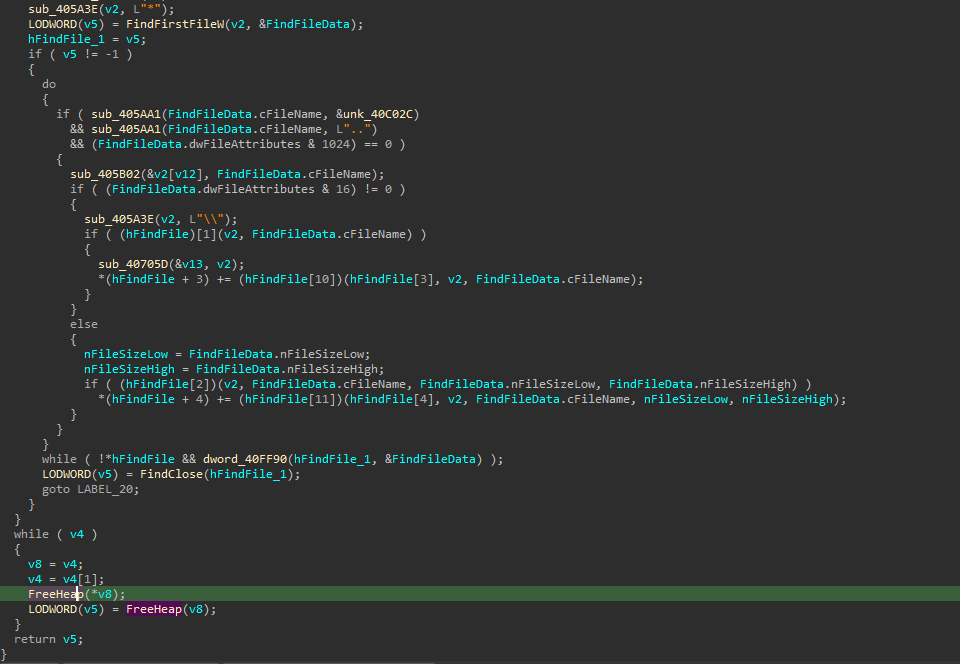

The key generation algorithm uses AES in counter mode and ECC 25519 donna.


The ransomware ues an embedded random generator and if it fail it will use the WinCrypt API to generate the random keys instead


Once the key gen process for a file is done the files then are encrypted by using a thread this is mostly to increase the speed of file encryption the ransomware uses salsa20 with the key and nonce created before.


So in short Sodinokibi uses ECC to keep the secret hidden and nulls any used secrets from memory after the key generation process is completed.

Since this key is public of an asymmetric encryption so it only would allow only one person to hold the private key to decrypt the secret that is used to generate file encryption key.

And also the fact that the way AES is being used to reduce the chances of recreation of encryption keys by following the same process.

Because of the way that the keys are created at this moment it is impossible to decrypt the files without the attacker's private key.